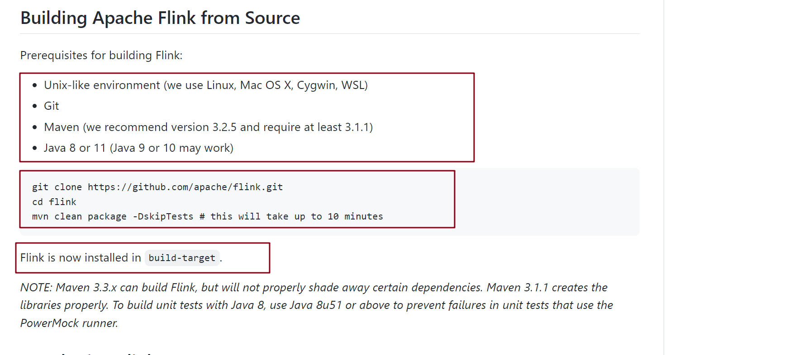

# 编译 Flink 源码
> 以 release-1.14.2 为例

## 编译环境
1. java8+
2. [maven3.2.5](http://archive.apache.org/dist/maven/maven-3/3.2.5/binaries/) (推荐这个版本)
3. nodejs
4. git
5. linux 环境(我这边使用 windows10+cygwin)
4. 外网加速器 (强烈推荐) 配置了这个之后, 不用再配置国内的源仓库了


贴一份 maven 配置文件

```xml
<?xml version="1.0" encoding="UTF-8"?>
<settings xmlns="http://maven.apache.org/SETTINGS/1.0.0"
  xmlns:xsi="http://www.w3.org/2001/XMLSchema-instance" xsi:schemaLocation="http://maven.apache.org/SETTINGS/1.0.0 http://maven.apache.org/xsd/settings-1.0.0.xsd">

  <!-- 本地仓库 -->
  <localRepository>D:/apache/m2/repo</localRepository>

  <pluginGroups>
  </pluginGroups>

  <proxies>
  </proxies>

  <servers>
  </servers>

  <mirrors>
<!--  这里使用的是默认仓库 -->
  </mirrors>

  <profiles>
  </profiles>

</settings>

```


## 源码克隆



> 官方仓库上说明了使用源码构建 Flink 的必要条件, 构建过程真的很长

```shell
git clone https://github.com/apache/flink.git 
```

如果尝试多次之后, 下载失败, 尝试从加速地址下载 [加速仓库](https://github.com.cnpmjs.org/apache/flink.git)

```shell
cd flink && git checkout release-1.14.2 
```


## 源码构建 flink

> 记得打开外网的加速, 不然有很多的依赖下载不了

```shell
mvn clean install -DskipTests  -Dfast  -Dcheckstyle.skip=true
```

其中可能会遇到错误, 多尝试几次, 有可能是拉取依赖包失败, 这可能需要换取代理或直接使用中央仓库+tizi


