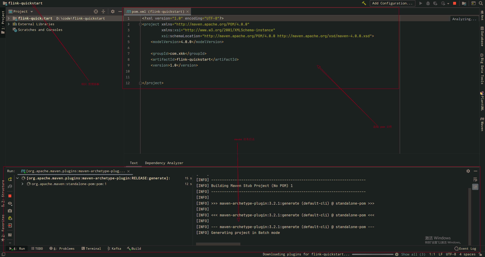

#  flink 快速开始

> 使用 java 实现

## 开发环境配置

1. windows 10 java 环境配置(jdk8以上的版本)

   * [下载java8的任意一个版本](https://download.oracle.com/otn/java/jdk/8u311-b11/jdk-8u311-windows-x64.exe)

     

2. maven 配置

   * maven 配置文件 **请酌情根据需求修改**

     ```shell
     <?xml version="1.0" encoding="UTF-8"?>
     <settings xmlns="http://maven.apache.org/SETTINGS/1.2.0"
         xmlns:xsi="http://www.w3.org/2001/XMLSchema-instance" xsi:schemaLocation="http://maven.apache.org/SETTINGS/1.2.0 https://maven.apache.org/xsd/settings-1.2.0.xsd">
     
         <!-- 配置本地仓库 -->
         <localRepository>D:/apache/m2/repo</localRepository>
         <pluginGroups></pluginGroups>
         <proxies></proxies>
         <servers></servers>
         <mirrors>
             <!-- 配置代理仓库 -->
             <mirror>
                 <id>alimaven</id>
                 <mirrorOf>central</mirrorOf>
                 <name>aliyun maven</name>
                 <url>http://maven.aliyun.com/nexus/content/repositories/central/</url>
             </mirror>
         </mirrors>
         <profiles></profiles>
     </settings>
     
     ```

     

3. IDEA  


## 创建 quickstart 项目


1. 添加 archtype


2. 根据 archtype 创建新的项目

   

3. 填写项目基本信息

   

4. 配置 maven 

   

5. 管理面板

   

6. classNotFound 处理

   


provided 

