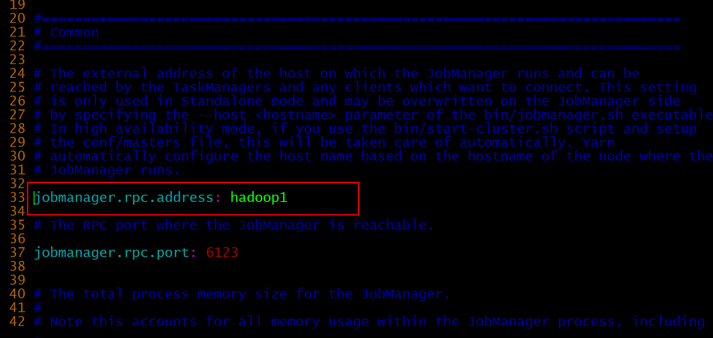
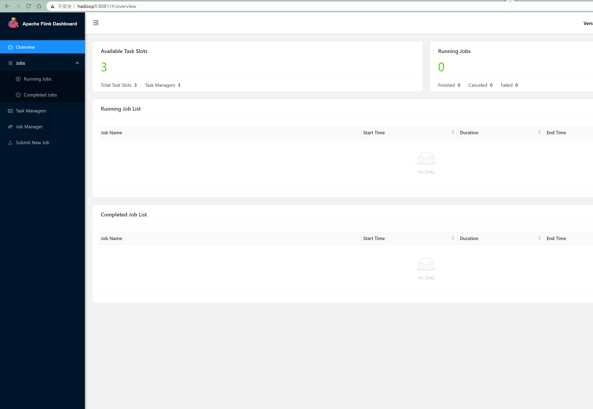
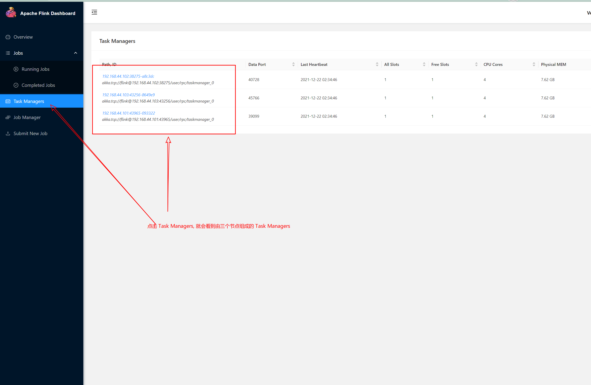

# flink standalone 集群搭建


## 前置软件依赖准备

1. linux 集群免密登录

2. java8 + 运行时

   [java8sdk 下载地址](https://www.oracle.com/java/technologies/downloads/#java8)

   下载完成之后, 分别上传到集群的每台主机的相同位置(为了方便处理), 我这里上传到  `/home/opt` 文件夹  查看文件信息: `ll /home/opt/jdk-8u311-linux-x64.tar.gz`

   然后解压

   ```shell
    tar -zxvf jdk-8u311-linux-x64.tar.gz # 解压 jdk
     mv jdk1.8.0_311 jdk8 #  重命名文件夹
    
   ```

   **配置环境变量**, 

   ```shell
   vim /etc/profile
   ```

   

   在系统配置环境变量中加入 java 运行时配置

   ```shell
   # java 环境
   export JAVA_HOME=/home/opt/jdk8  # 配置 JAVA_HOME 变量
   export PATH=$PATH:$JAVA_HOME/bin  # 将 jdk 下的可执行文件加入环境变量
   export CLASSPATH=.:$JAVA_HOME/jre/lib/rt.jar:$JAVA_HOME/lib/dt.jar:$JAVA_HOME/lib/tools.jar #  配置 classpath
   ```

   

   **每台主机都要执行相同的操作**

   

3. flink 1.14.2 

​	[flink 归档仓库地址](https://archive.apache.org/dist/flink/), 这边选择的是, [flink 1.14.2 scala2.11版本](https://archive.apache.org/dist/flink/flink-1.14.2/flink-1.14.2-bin-scala_2.11.tgz)

```shell
# 解压并命名
wget https://archive.apache.org/dist/flink/flink-1.14.2/flink-1.14.2-bin-scala_2.11.tgz # 下载flink
tar -zxvf flink-1.14.2-bin-scala_2.11.tgz # 解压
mv flink-1.14.2-bin-scala_2.11 flink  # 文件夹重命名
cp /etc/profile /etc/profile.bak # 备份 系统配置文件
 
 # 配置 flink 环境
 echo "#flink 环境配置" >> /etc/profile
 echo "export FLINK_HOME=$(pwd)/flink" >> /etc/profile
 echo "PATH=$PATH:$FLINK_HOME" >> /etc/profile
 
 # 使 flink 环境生效
 source /etc/profile 
 
 # 验证安装是否生效
 flink --version # 打印 flink 的版本信息
```


## 配置 flink 

#### 修改 flink 的启动配置，master 文件以及增加 slaves 文件

```shell
# 备份原来的配置文件
cp $FLINK_HOME/conf/flink-conf.yaml $FLINK_HOME/conf/flink-conf.yaml.bak

# 修改 flink 的配置文件
vim  $FLINK_HOME/conf/flink-conf.yaml
```

修改这一行, <span style="color:red;font-size:20px">`jobmanager.rpc.address: hadoop1`</span>  其中 hadoop1 是主机的 hostname, 这里修改成为你自己的主机就好了




#### 修改 masters 文件

```shell
cp $FLINK_HOME/conf/masters  $FLINK_HOME/conf/masters.bak
# 用 hadoop1:8081 替换原来的内容 
 echo "hadoop1:8081" > $FLINK_HOME/conf/masters 
```


#### 增加 slaves 文件

```shell
echo "hadoop2" > $FLINK_HOME/conf/slaves
echo "hadoop3" >> $FLINK_HOME/conf/slaves
```

**将上面的操作同步到其他两台主机或者到两台主机上进行相同的操作**


## 启动 flink 集群并验证

在 hadoop1 节点上执行启动 flink 的操作

```shell
/bin/bash $FLINK_HOME/bin/start-cluster.sh
```

**这一步， 可能需要到其他的两个节点上执行相同的命令**

启动成功的话， 打开 [flink dashboard](http://hadoop1:8081) 



会看到这个页面， 怎么验证集群已经启动成功了呢？ 



## 排错参考

1. 集群组网不成功，看了是否是防火墙的原因