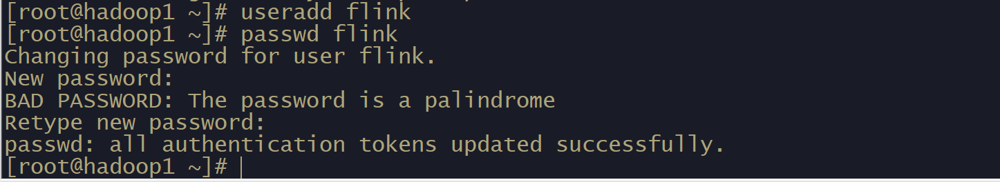
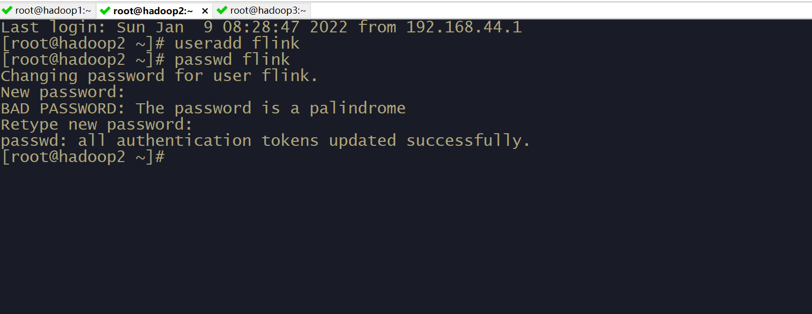
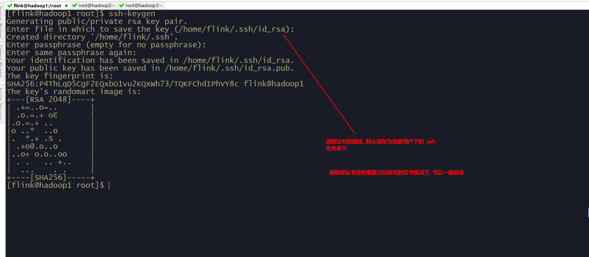
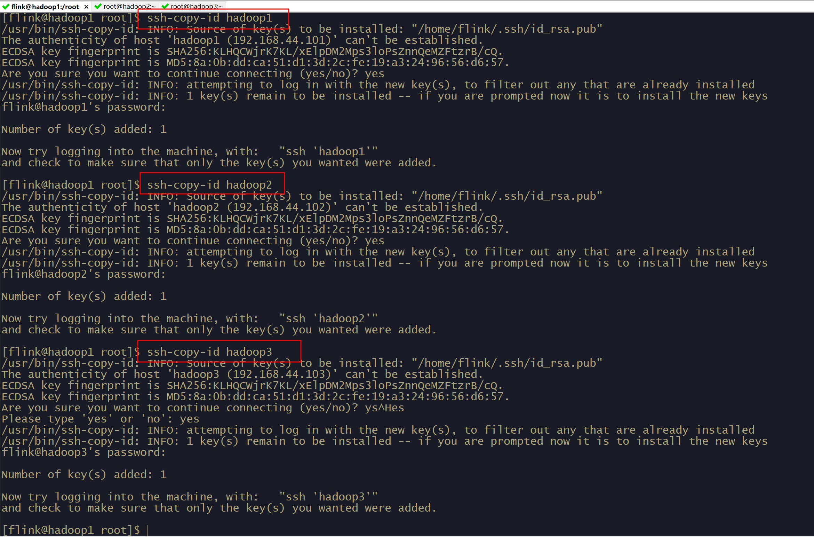
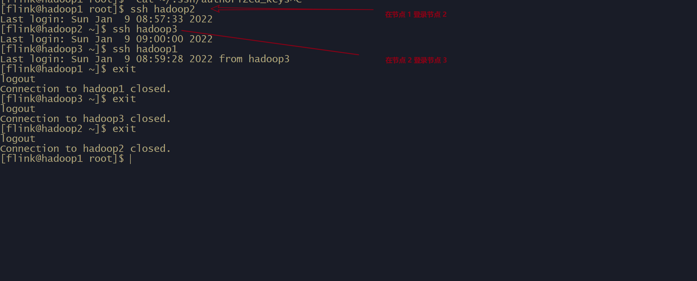

# linux 集群免密登录


> 集群之间为什么需要免密码登录: 为了linux 之间方便登录, 比如  `flink:start-cluster.sh` 脚本的工作

## 

## linux 创建用户

> 具体的操作图所示

```shell
useradd flink # 创建一个 用户, 名字叫做 flink 
passwd flink # 修改 flink 的用户密码
```



这个操作在 linux 集群的其他主机上执行相同的操作




## 设定免密登录

> 生成证书(私钥和公钥)

```shell
su  flink # 切换到新创建的用户
ssh-keygen # 生成证书指令
```




将 `hadoop1` (主机名) 上 `flink` 用户的证书复制到其他的两个节点, 将授权文件

```shell
ssh-copy-id hadoop1 # 将 flink 用户等公钥复制并追加到 hadoop1 主机的 authorized_keys 文件
ssh-copy-id hadoop2 # 将 flink 用户等公钥复制并追加到 hadoop2 主机的 authorized_keys 文件
ssh-copy-id hadoop3 # 将 flink 用户等公钥复制并追加到 hadoop3 主机的 authorized_keys 文件
```




**在集群的两个节点上进行同样的操作**

三台主机上都操作完成之后, 使用命令查看, 就能看到对应的 公钥, 用户名, 以及主机号, 这样就能实现集群的免密登录了


## 集群之间验证


