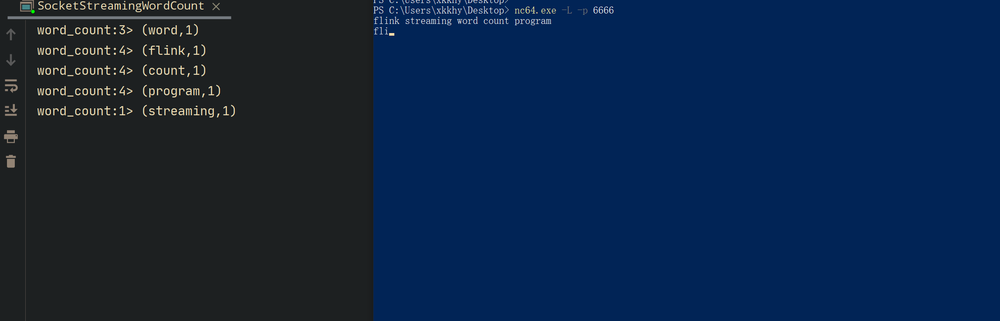

# Flink streaming word count 程序
> 第一个 Flink 程序

## Flink 流 API 编程模型
1. 获取执行环境
2. 添加一个或者多个数据源
3. 添加dataflow的算子
4. 处理结果
5. 运行 Flink 程序

## 环境准备
1. Flink 1.14.2
2. idea 2020.2.3
3. maven 3.2.5
4. java8+
5. [netcat](https://eternallybored.org/misc/netcat/)

## 构建Flink streaming word count 程序

>  windows 环境 netcat 使用 `-L` 表示重新监听的方式启动该 netcat 程序

1. 先启动 wordcount 程序
2. 然后本地运行 Flink 程序

```shell
nc64.ext -L -p 6666
```





## 逻辑说明

1. 通过[ExecutionEnvironment](https://github.com/apache/flink/blob/release-1.14/flink-java/src/main/java/org/apache/flink/api/java/ExecutionEnvironment.java) 类创造 Flink 执行环境

 ```java
   LocalStreamEnvironment env = StreamExecutionEnvironment.createLocalEnvironment();
 ```

2. 添加 [socketstream](https://github.com/apache/flink/blob/release-1.14/flink-streaming-java/src/main/java/org/apache/flink/streaming/api/environment/StreamExecutionEnvironment.java#L1621:37) 数据源, 默认是换行符做为输入完成的标志

   ```java
       @PublicEvolving
       public DataStreamSource<String> socketTextStream(String hostname, int port) {
           return socketTextStream(hostname, port, "\n");
       }
   ```

3. 添加 [flatMap](https://github.com/apache/flink/blob/release-1.14/flink-streaming-java/src/main/java/org/apache/flink/streaming/api/datastream/DataStream.java#L609:17) 算子, 

   flatmap 将一个输入的数据加工处理, 输出多个数据, 其中, 算子内部优先会通过`TypeExtractor`获取算子的返回类型

   ```java
      /**
        * Applies a FlatMap transformation on a {@link DataStream}. The transformation calls a {@link
        * FlatMapFunction} for each element of the DataStream. Each FlatMapFunction call can return any
        * number of elements including none. The user can also extend {@link RichFlatMapFunction} to
        * gain access to other features provided by the {@link
        * org.apache.flink.api.common.functions.RichFunction} interface.
        *
        * @param flatMapper The FlatMapFunction that is called for each element of the DataStream
        * @param <R> output type
        * @return The transformed {@link DataStream}.
        */
       public <R> SingleOutputStreamOperator<R> flatMap(FlatMapFunction<T, R> flatMapper) {
   
           TypeInformation<R> outType =
                   TypeExtractor.getFlatMapReturnTypes(
                           clean(flatMapper), getType(), Utils.getCallLocationName(), true);
   
           return flatMap(flatMapper, outType);
       }
   ```

4. 添加 [keyBy](https://github.com/apache/flink/blob/release-1.14/flink-streaming-java/src/main/java/org/apache/flink/streaming/api/datastream/DataStream.java#L304:17) 算子, 将元素按照指定的字段分组, 返回的对象是 `KeyedStream`

   ```java
      /**
        * It creates a new {@link KeyedStream} that uses the provided key with explicit type
        * information for partitioning its operator states.
        *
        * @param key The KeySelector to be used for extracting the key for partitioning.
        * @param keyType The type information describing the key type.
        * @return The {@link DataStream} with partitioned state (i.e. KeyedStream)
        */
       public <K> KeyedStream<T, K> keyBy(KeySelector<T, K> key, TypeInformation<K> keyType) {
           Preconditions.checkNotNull(key);
           Preconditions.checkNotNull(keyType);
           return new KeyedStream<>(this, clean(key), keyType);
       }
   ```

5. 进行 [sum](https://github.com/apache/flink/blob/release-1.14/flink-streaming-java/src/main/java/org/apache/flink/streaming/api/datastream/KeyedStream.java#L767)分组求和

   ```java
       /**
        * Applies an aggregation that gives a rolling sum of the data stream at the given position
        * grouped by the given key. An independent aggregate is kept per key.
        *
        * @param positionToSum The field position in the data points to sum. This is applicable to
        *     Tuple types, basic and primitive array types, Scala case classes, and primitive types
        *     (which is considered as having one field).
        * @return The transformed DataStream.
        */
       public SingleOutputStreamOperator<T> sum(int positionToSum) {
           return aggregate(new SumAggregator<>(positionToSum, getType(), getExecutionConfig()));
       }
   
   ```

6. 执行 Flink 程序

## 完整的实例代码


```java
package com.xkk.stream.wordcount;


import org.apache.flink.api.common.functions.RichFlatMapFunction;
import org.apache.flink.api.java.functions.KeySelector;
import org.apache.flink.api.java.tuple.Tuple2;
import org.apache.flink.api.java.utils.ParameterTool;
import org.apache.flink.configuration.Configuration;
import org.apache.flink.streaming.api.datastream.DataStreamSource;
import org.apache.flink.streaming.api.environment.LocalStreamEnvironment;
import org.apache.flink.streaming.api.environment.StreamExecutionEnvironment;
import org.apache.flink.util.Collector;

// Flink 编程模型:
// 1. 创建 Flink 运行环境
// 2. 为运行环境添加数据源
// 3. 为 DataFlow 添加一个或者多个算子
// 4. 将运算之后的结果发送到何处
// 5. 执行 Flink 程序
// 其中 算子和 sink 必须要有其中的一个

// 从 socket 流中说去输入数据
// 如果输入多个字符, 按照空格切分, 将切分之后的结果按照 单词进行重新物理分组, 分组完成之后, 计算每个输入单词的总数
// 此例子中没有统计输入的状态
//
public class SocketStreamingWordCount {

    public static void main(String[] args) throws Exception {
        // 从程序运行参数中初始化 ParameterTool 对象
        ParameterTool params = ParameterTool.fromArgs(args);

        // 获取输入参数中的 hostname 的值, 默认值是 hadoop1
        String host = params.get("hostname", "hadoop1");

        // 从输入参数中获取 port 的值, 默认值是 6666
        int port = params.getInt("port", 6666);

        // 从输入参数中获取 flink 程序的并行度,  默认值是 4
        int parallel = params.getInt("parallel", 4);

        // 1. 获取 flink 程序的可执行环境
        LocalStreamEnvironment env = StreamExecutionEnvironment.createLocalEnvironment();

        // 禁用 operatorChaining 优化
        env.disableOperatorChaining();

        // 设置程序的并行度, 默认值是 4
        env.setParallelism(parallel);

        // 2. 添加程序的 socket 输入源, 遇到换行符号作为一个流输入对象
        DataStreamSource<String> socket = env.socketTextStream(host, port, "\n");

        // 3. 添加程序的算子
        socket.flatMap(
                // 将上一个算子的输入参数扁平化,
                // @param String 上一个算子的输入对象为 String
                // @param Tuple2<String,Integer>  当前算子的输出对象为 Tuple2<String,Integer> 的元组对象
                new RichFlatMapFunction<String, Tuple2<String, Integer>>() {
                    @Override
                    public void flatMap(
                            String input, // 上一个算子的输入参数
                            Collector<Tuple2<String, Integer>> out // flatMap 算子的输出对象
                    ) throws Exception {
                        // 将上一个算子的输出值, 按照空格进行切分, 然后返回一个元组对象,
                        // 元组的第一个元素表示切分之后的单词
                        // 元组的第二个元素表示切分之后, 产生单词的个数
                        for (String s : input.split(" ")) {
                            if (s.equals("")) {
                                continue;
                            }
                            // 将单词切分后, 返回单词和单词的个数
                            out.collect(Tuple2.of(s, 1));
                        }
                    }

                    @Override
                    public void open(Configuration parameters) throws Exception {
                        super.open(parameters);
                    }
                    // keyBy 算子, 功能是将算子的输入进行分区
                    // 第一个参数为 上一个算子的输出对象的类型
                    // 第二个参数为 选择 key 的元素作为物理分区的键
                    // 内部会计算 key 的 hash (murmurhash) 然后再 模除并行度的方式得到物理分区
                }).keyBy(new KeySelector<Tuple2<String, Integer>, String>() {
            @Override
            public String getKey(Tuple2<String, Integer> input) throws Exception {
                // 这里选择按照单词进行分组
                // 由于这里使用的是 Tuple2<String,Integer>, 元组的第一个元素为 单词, 第二个元素为单词的个数
                return input.f0;
            }
        }).sum(1)
                // 4. sink
                .print("word_count");

        // 5. 执行 Flink 程序
        env.execute("stream_word_count");

    }
}

```

